# Toddler's Ally
## Introduction

The live link can be found here - (https://toddlers-ally.herokuapp.com/)

Welcome to my fifth project. This project is an e-commerce store for Toddlers and Kidd's. Users will be able to purchase their toddler or kids daily usefull and helpful products from this website. This project will use languages and frameworks such as Django, Python, HTML, CSS and JavaScript.

In this project, I will set up an authentication mechanism and provide access to the site's data for users to purchase a range of products.

The admin of the website will also have the ability to use all CRUD functionality (Create, Read, Update, Delete).

## Table of Contents

# Table of Contents
 [1. User Expereince (UX) design](#ux)
  - [1.1. Strategy:](#strategy)
    - [Project Goals](#project-goals)
        - [User Goals](#user-goals)
        - [User Expectation](#user-expectation)
        - [User Stories](#user-stories)
  - [1.2. Skeleton](#skeleton)
  - [1.3. Structure](#structure)
  - [1.3. Surface](#surface)

 [2. Features](#features)

 [3.Technologies used](#technologies-used)

 [4.Testing](#testing)

 [5.Bugs](#bugs)

 [6. Deployment](#deployment)
  - [6.1. Libraries](#libraries)
  - [6.2. GitHub](#github)
  - [6.3. Heroku](#heroku)

 [7.SEO](#seo)

 [8.Marketing](#marketing)

 [9.Social Media](#Socialmedia)

 [9.End Product](#endproduct)

 [10. Acknowledgement](#acknowledgement)

 
# 1. User Expereince (UX) design
 [Go to top](#table-of-contents)

 Toddler's Ally is basicaly for new born kids and 1 to 5 years kids stuff. Mother's can order stuff of their like and what is best for their kid. because new baby's are very senstive so the product is buying must be very good in quality and approved by the authories. so keeping in mind i select the product manufacturer's which are well and are widley used by people.
 This project will showcase a range of Toddlers and kids products for customers to purchase. The site will be clear and easily accessible. The best e-commerce stores display simply but clear navigation around the site, with an intuitive design.

 
 # 1.1. Strategy
  [Go to top](#table-of-contents)

 
  ### Project Goals

 One of the main goals of the project is to create a simple and intuitive store where customers can purchase toddler's related items. Products will be presented in an elegant and easy view. All site users will be able to navigate around the website.

 
 ### User Goals:
 First Time Visitor Goals:
 * As a first-time visitor, I want to be able to view a list of products so that I can select some to purchase
 * As a first-time visitor, I want to view a specific category of products so that I can quickly find products I'm interested in without having to search through all products.
 * As a first-time visitor, I want to quickly identify deals so that I can take advantage of special savings on products I'd like to purchase.
 * As a first-time visitor, I want to search for a product key by name or description so that I can find a specific product I'd like to purchase.
 * As a first-time visitor, I want to view individual product details so that I can identify the price, description, product rating, product image and available sizes.
 * As a first-time visitor, I want to easily view the total of my purchases at any time so that I can avoid spending too much.
 * As a first-time visitor, I want to sort the list of available products so that I can easily identify the best rated, best priced and categorically sorted products.
 * As a first-time visitor, I want to sort a specific category of products so that I can find the best-priced or best-rated products in a specific category, or sort the products in that category by name.
 * As a first-time visitor, I want to easily add items to my basket so that I can view all the products I would like to purchase before completing payment.
 * As a first-time visitor, I want to easily remove items and update quantities from my basket so that I can remove any products I do not want before checking out.
 * As a first-time visitor, I want to easily select the size/weight and quantity of a product when purchasing it so that I can ensure I don’t accidentally select the wrong product, quantity or size.
 * As a first-time visitor, I want to easily enter my payment information at the checkout page so that I can checkout with no hassles.
 * As a first-time visitor, I want to feel safe and secure with my personal and payment information so that I can confidently provide the details to make a purchase.
 * As a first-time visitor, I want to be able to checkout as a guest. 

 Returning Visitor Goals
 * As a returning visitor, I want to create an account.
 * As a returning visitor, I want to update my user profile.
 * As a returning visitor, I want to view my order history.
 * As a returning visitor, I want to easily log in or logout so that I can access my personal account information.
 * As a returning visitor, I want to easily register for an account so that I can have a personal account and be able to view my profile.

 
  ### User Expectations:
 The website should have a simple user interface, with the navigation to each section clear and concise.

 * The menu is clear to read.
 * The user interface is easy to navigate.
 * The website is responsive on all devices.
 * To be able to see a clear selection of products.
 * Easily view the total of the basket before making any payment.
 * The website provides responsive feedback for any actions, for example when adding a product to the basket.

 
 ### User Stories

 Throughout the project, I used the GitHub projects board to log all user stories as my project management tool. This helped me keep the focus on the necessary tasks as I would move them to the "in progress lane" as I'm working on the story. I would then move them to the "done" lane once the story has been completed. I would add new user stories during the project to keep track of the tasks that had to be done.

 

 
 # 1.2. Skeleton
  [Go to top](#table-of-contents)

  ### Wireframes

  ### Home
  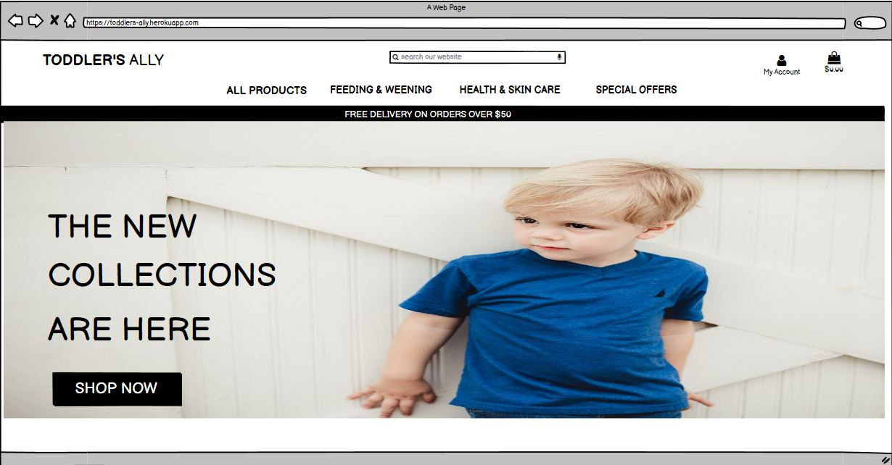

  ### All Products
  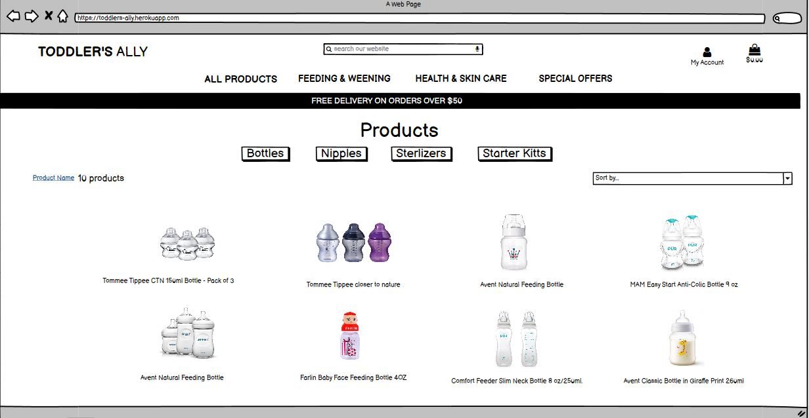

  ### Product Details
  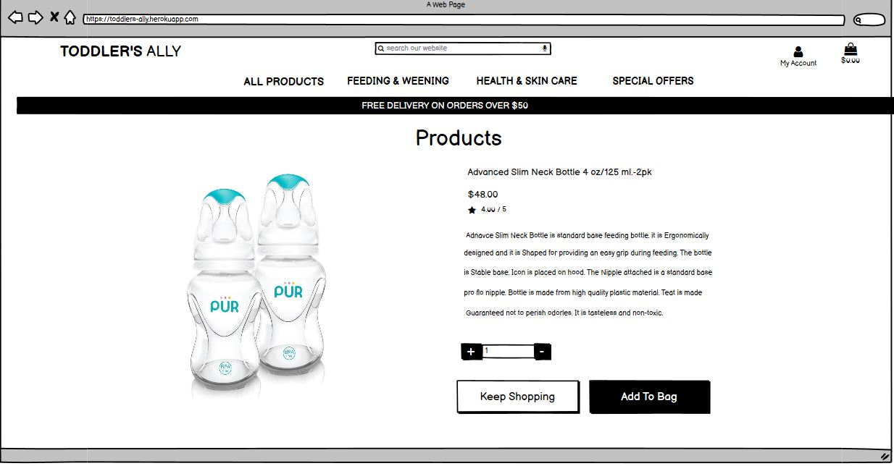

  ### Bag
  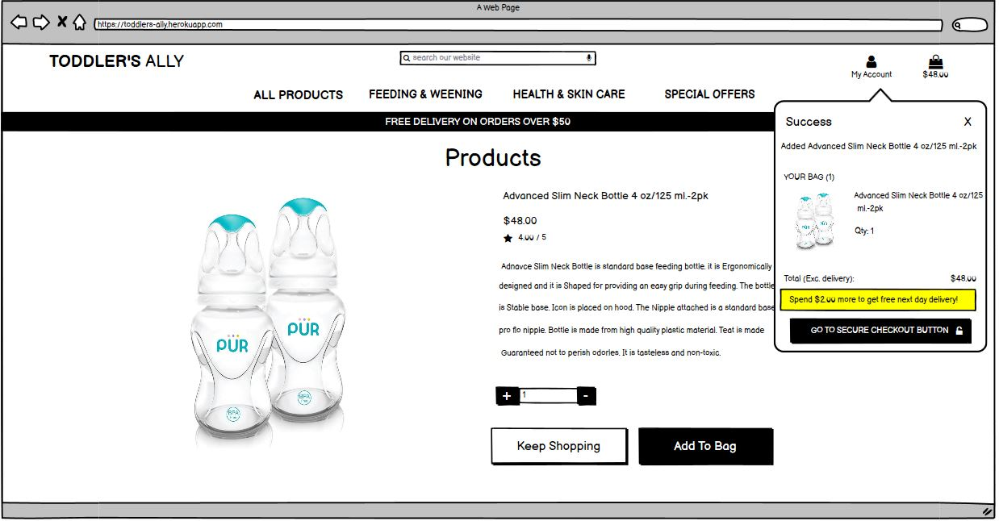

  ### Checkpout
  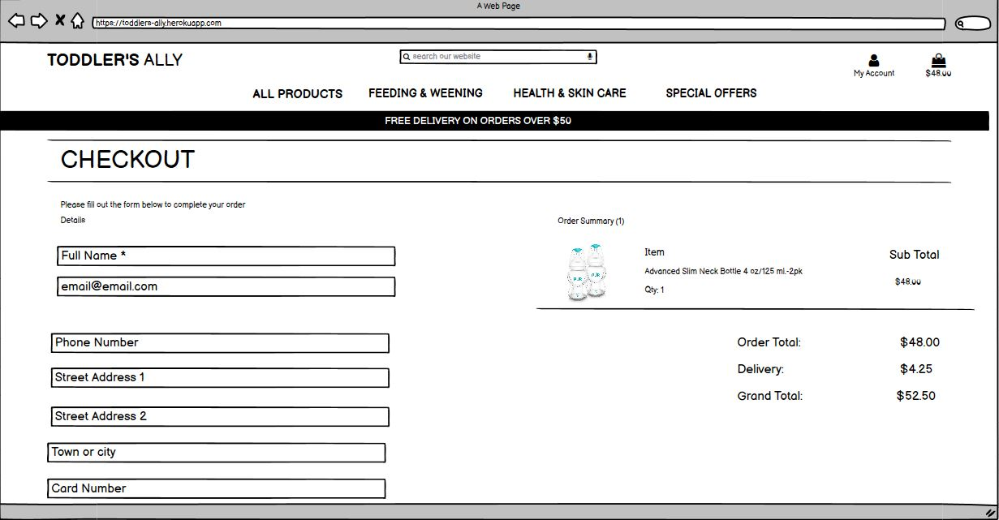

  ### Sign Up
  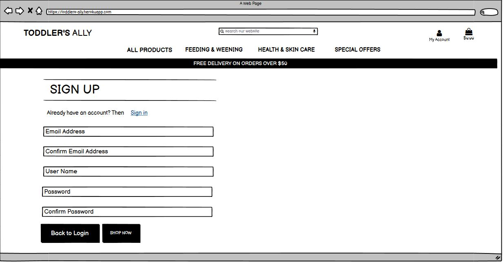

  ### Sign In
  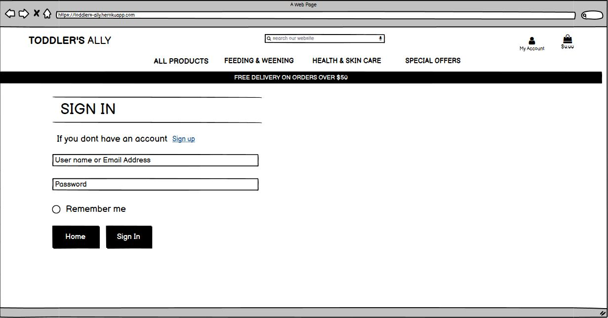

  ### Reset Password
  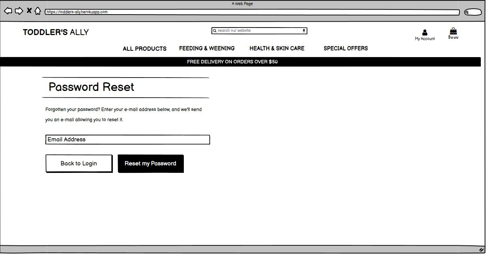

  ### change Password
  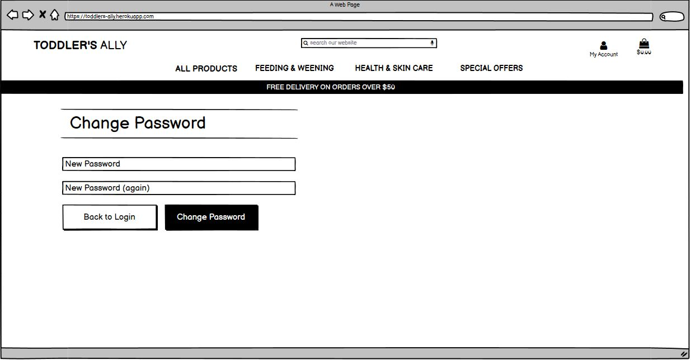

  ### Mobile Home
  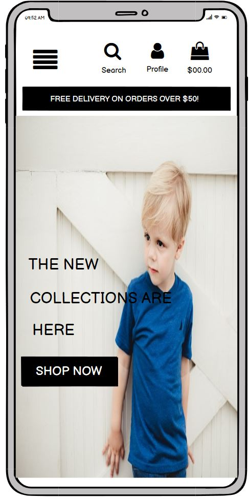

  ### Mobile Product
  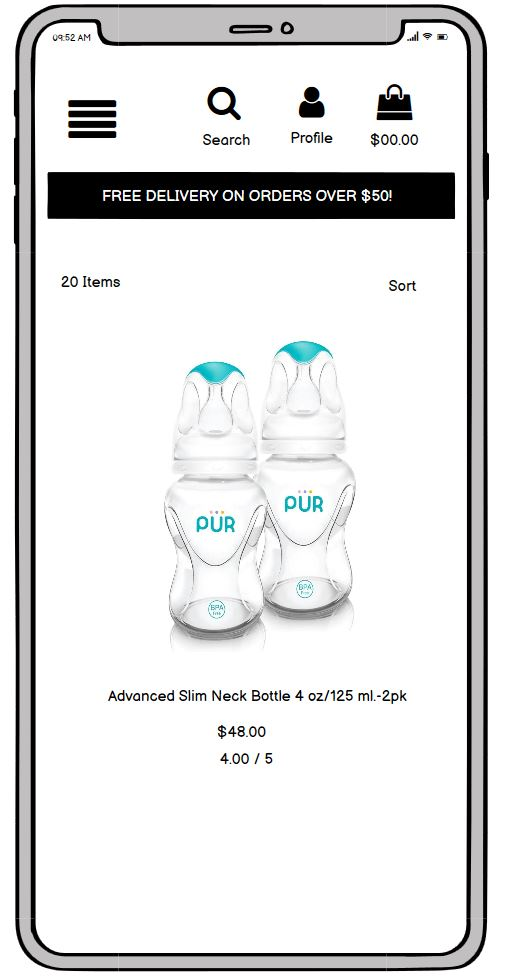

  ### Mobile Product Detail
  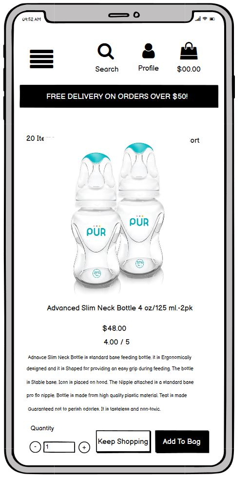

  ### Mobile SignIn
  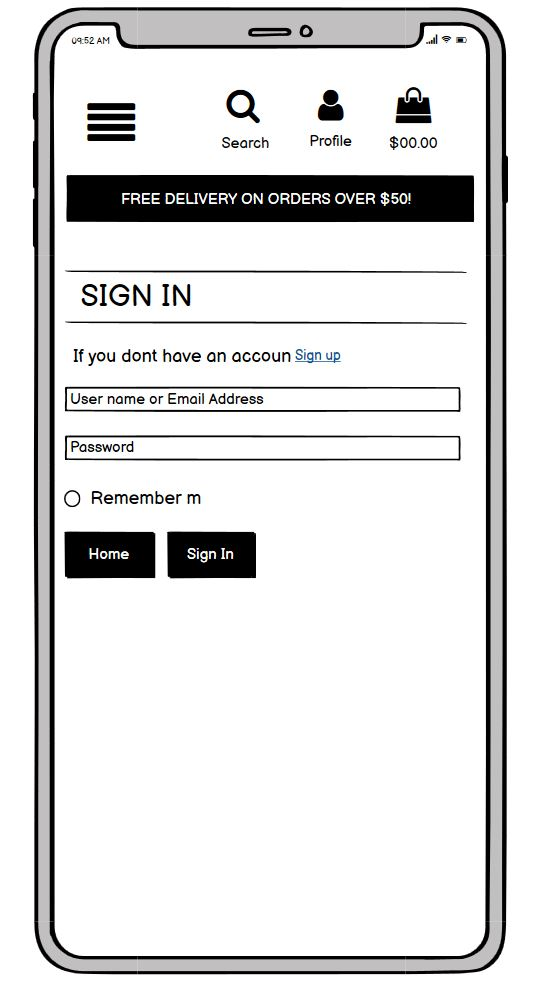

  ### Mobile Signup
  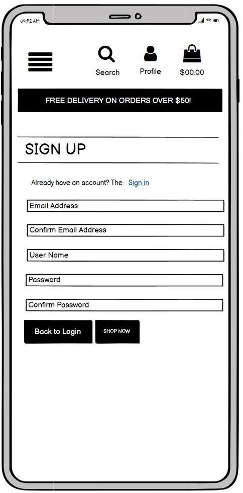
