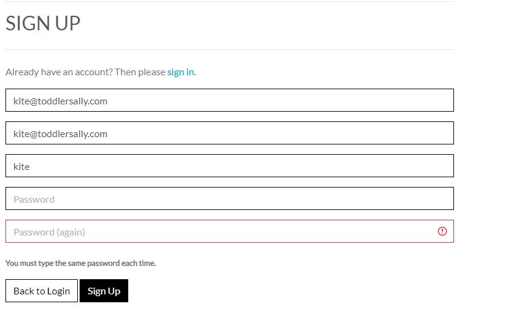

# Toddler's Ally
## Introduction

The live link can be found here - (https://toddlers-ally.herokuapp.com/)

Welcome to my fifth project. This project is an e-commerce store for Toddlers and Kidd's. Users will be able to purchase their toddler or kids daily usefull and helpful products from this website. This project will use languages and frameworks such as Django, Python, HTML, CSS and JavaScript.

In this project, I will set up an authentication mechanism and provide access to the site's data for users to purchase a range of products.

The admin of the website will also have the ability to use all CRUD functionality (Create, Read, Update, Delete).

## Table of Contents

# Table of Contents
 [1. User Expereince (UX) design](#ux)
  - [1.1. Strategy:](#strategy)
    - [Project Goals](#project-goals)
        - [User Goals](#user-goals)
        - [User Expectation](#user-expectation)
        - [User Stories](#user-stories)
  - [1.2. Skeleton](#skeleton)
  - [1.3. Structure](#structure)

 [2. Features](#features)

 [3.Technologies used](#technologies-used)

 [4.Testing](#testing)

 [5.Bugs](#bugs)

 [6. Deployment](#deployment)
  - [6.1. Libraries](#libraries)
  - [6.2. GitHub](#github)
  - [6.3. Heroku](#heroku)

 [7.SEO](#seo)

 [8.Marketing](#marketing)

 [9.Social Media](#Socialmedia)

 [9.End Product](#endproduct)

 [10. Acknowledgement](#acknowledgement)

 <a name="ux"></a>
# 1. User Expereince (UX) design
 [Go to top](#table-of-contents)

 Toddler's Ally is basicaly for new born kids and 1 to 5 years kids stuff. Mother's can order stuff of their like and what is best for their kid. because new baby's are very senstive so the product is buying must be very good in quality and approved by the authories. so keeping in mind i select the product manufacturer's which are well and are widley used by people.
 This project will showcase a range of Toddlers and kids products for customers to purchase. The site will be clear and easily accessible. The best e-commerce stores display simply but clear navigation around the site, with an intuitive design.

 <a name="strategy"></a>
 # 1.1. Strategy
  [Go to top](#table-of-contents)

 <a name="project-goals"></a>
  ### Project Goals

 One of the main goals of the project is to create a simple and intuitive store where customers can purchase toddler's related items. Products will be presented in an elegant and easy view. All site users will be able to navigate around the website.

 <a name="user-goals"></a>
 ### User Goals:
 First Time Visitor Goals:
 * As a first-time visitor, I want to be able to view a list of products so that I can select some to purchase
 * As a first-time visitor, I want to view a specific category of products so that I can quickly find products I'm interested in without having to search through all products.
 * As a first-time visitor, I want to quickly identify deals so that I can take advantage of special savings on products I'd like to purchase.
 * As a first-time visitor, I want to search for a product key by name or description so that I can find a specific product I'd like to purchase.
 * As a first-time visitor, I want to view individual product details so that I can identify the price, description, product rating, product image and available sizes.
 * As a first-time visitor, I want to easily view the total of my purchases at any time so that I can avoid spending too much.
 * As a first-time visitor, I want to sort the list of available products so that I can easily identify the best rated, best priced and categorically sorted products.
 * As a first-time visitor, I want to sort a specific category of products so that I can find the best-priced or best-rated products in a specific category, or sort the products in that category by name.
 * As a first-time visitor, I want to easily add items to my basket so that I can view all the products I would like to purchase before completing payment.
 * As a first-time visitor, I want to easily remove items and update quantities from my basket so that I can remove any products I do not want before checking out.
 * As a first-time visitor, I want to easily select the size/weight and quantity of a product when purchasing it so that I can ensure I don’t accidentally select the wrong product, quantity or size.
 * As a first-time visitor, I want to easily enter my payment information at the checkout page so that I can checkout with no hassles.
 * As a first-time visitor, I want to feel safe and secure with my personal and payment information so that I can confidently provide the details to make a purchase.
 * As a first-time visitor, I want to be able to checkout as a guest. 

 Returning Visitor Goals
 * As a returning visitor, I want to create an account.
 * As a returning visitor, I want to update my user profile.
 * As a returning visitor, I want to view my order history.
 * As a returning visitor, I want to easily log in or logout so that I can access my personal account information.
 * As a returning visitor, I want to easily register for an account so that I can have a personal account and be able to view my profile.

 <a name="user-expectation"></a>
  ### User Expectations:
 The website should have a simple user interface, with the navigation to each section clear and concise.

 * The menu is clear to read.
 * The user interface is easy to navigate.
 * The website is responsive on all devices.
 * To be able to see a clear selection of products.
 * Easily view the total of the basket before making any payment.
 * The website provides responsive feedback for any actions, for example when adding a product to the basket.

 <a name="user-stories"></a>
 ### User Stories

 Throughout the project, I used the GitHub projects board to log all user stories as my project management tool. This helped me keep the focus on the necessary tasks as I would move them to the "in progress lane" as I'm working on the story. I would then move them to the "done" lane once the story has been completed. I would add new user stories during the project to keep track of the tasks that had to be done.

 

 <a name="skeleton"></a>
 # 1.2. Skeleton
  [Go to top](#table-of-contents)

  ### Wireframes

  ### Home
  

  ### All Products
  

  ### Product Details
  

  ### Bag
  

  ### Checkpout
  

  ### Sign Up
  

  ### Sign In
  

  ### Reset Password
  

  ### change Password
  

  ### Mobile Home
  

  ### Mobile Product
  

  ### Mobile Product Detail
  

  ### Mobile SignIn
  

  ### Mobile Signup
  

  <a name="structure"></a>
 # 1.3. Structure
  [Go to top](#table-of-contents)

  Checkout model structure:

```python
class Order(models.Model):
    """
    A model for the customer order
    """

    order_number = models.CharField(max_length=32, null=False, editable=False)
    user_profile = models.ForeignKey(
        UserProfile, on_delete=models.SET_NULL, null=True, blank=True,
        related_name='orders')
    full_name = models.CharField(max_length=50, null=False, blank=False)
    email = models.EmailField(max_length=254, null=False, blank=False)
    phone_number = models.CharField(max_length=20, null=False, blank=False)
    country = CountryField(blank_label="Country *", null=False, blank=False)
    postcode = models.CharField(max_length=20, null=True, blank=True)
    town_or_city = models.CharField(max_length=40, null=False, blank=False)
    street_address_1 = models.CharField(max_length=80, null=False, blank=False)
    street_address_2 = models.CharField(max_length=80, null=True, blank=True)
    county = models.CharField(max_length=80, null=True, blank=True)
    date = models.DateTimeField(auto_now=True)
    delivery_cost = models.DecimalField(
        max_digits=6, decimal_places=2, null=False, default=0)
    order_total = models.DecimalField(
        max_digits=10, decimal_places=2, null=False, default=0)
    grand_total = models.DecimalField(
        max_digits=10, decimal_places=2, null=False, default=0)
    original_bag = models.TextField(null=False, blank=False, default='')
    stripe_pid = models.CharField(
        max_length=254, null=False, blank=False, default='')

    def _generate_order_number(self):
        """ Generates a random, unique order number """
        return uuid.uuid4().hex.upper()

    def update_total(self):
        """
        Update the grand total each time a line item is added,
        accounting for delivery costs
        """
        self.order_total = self.lineitems.aggregate(
            Sum('lineitem_total'))['lineitem_total__sum'] or 0
        if self.order_total < settings.FREE_DELIVERY_THRESHOLD:
            self.delivery_cost = self.order_total * settings.STANDARD_DELIVERY_PERCENTAGE / 100
        else:
            self.delivery_cost = 0
        self.grand_total = self.order_total + self.delivery_cost
        self.save()

    def save(self, *args, **kwargs):
        """
        Orverride the original save method to set the order number
        if it hasn't already been set
        """
        if not self.order_number:
            self.order_number = self._generate_order_number()
        super().save(*args, **kwargs)

    def __str__(self):
        return self.order_number


class OrderLineItem(models.Model):
    order = models.ForeignKey(
        Order, on_delete=models.CASCADE, null=False, blank=False,
        related_name='lineitems')
    product = models.ForeignKey(
        Product, on_delete=models.CASCADE, null=False, blank=False)
    product_weight = models.CharField(max_length=5, null=True, blank=True)
    quantity = models.IntegerField(null=False, blank=False, default=0)
    lineitem_total = models.DecimalField(
        max_digits=6, decimal_places=2, null=False, blank=False,
        editable=False)

    def save(self, *args, **kwargs):
        """
        Orverride the original save method to set the lineitem total
        and update the order total
        """
        self.lineitem_total = self.product.price * self.quantity
        super().save(*args, **kwargs)

    def __str__(self):
        return f'SKU {self.product.sku} on order {self.order.order_number}'
```

Products model structure:

```python
class Category(models.Model):

    class Meta:
        verbose_name_plural = 'Categories'

    name = models.CharField(max_length=254)
    friendly_name = models.CharField(max_length=254, null=True, blank=True)

    def __str__(self):
        return self.name

    def get_friendly_name(self):
        return self.friendly_name


class Product(models.Model):
    category = models.ForeignKey(
        'Category', null=True, blank=True, on_delete=models.SET_NULL)
    sku = models.CharField(max_length=254, null=True, blank=True)
    name = models.CharField(max_length=254)
    description = models.TextField()
    has_weight = models.BooleanField(default=False, null=True, blank=True)
    price = models.DecimalField(max_digits=6, decimal_places=2)
    rating = models.DecimalField(
        max_digits=6, decimal_places=2, null=True, blank=True)
    image_url = models.URLField(max_length=1024, null=True, blank=True)
    image = models.ImageField(null=True, blank=True)

    def __str__(self):
        return self.name
```

User Profile model structure:

```python
class UserProfile(models.Model):
    user = models.OneToOneField(User, on_delete=models.CASCADE)
    default_phone_number = models.CharField(
        max_length=20, null=True, blank=True)
    default_street_address_1 = models.CharField(
        max_length=80, null=True, blank=True)
    default_street_address_2 = models.CharField(
        max_length=80, null=True, blank=True)
    default_town_or_city = models.CharField(
        max_length=40, null=True, blank=True)
    default_postcode = models.CharField(
        max_length=20, null=True, blank=True)
    default_county = models.CharField(
        max_length=80, null=True, blank=True)
    default_country = CountryField(
        blank_label="Country", null=True, blank=True)

    def __str__(self):
        return self.user.email


@receiver(post_save, sender=User)
def create_or_update_user_profile(sender, instance, created, **kwargs):
    """vCreate or update the user profile """
    if created:
        UserProfile.objects.create(user=instance)
    instance.userprofile.save()
```
<a name="features"></a>
# 2. Features
 [Go to top](#table-of-contents)

 * The navigation bar is placed at the top of all pages. This contains 2 sections that are separated. The first section is  the product search bar, my account icon and the basket icon. The second section contains the main navigation for the products. The navigation bar is dynamic in that meaning depending on if the user is logged in or not the options will change.

 * If the user is not logged in the navigation bar will show user login and signin link:
 * If the user is logged in the navigation bar will show authenticated roles. Which will Product management, User Profile.
 
 ### Sign Up Page
 * A simple signup form that requires the user to enter a unique email address and a password. The password must be entered again for confirmation, this must match the already entered password above.
 
 * A message to prompt the user that if an account is already been created they can click the sign-in hyperlink to be redirected to the sign-in page.

 * If the user enters an email address that has already been registered, the user is prompted by an error message.

 

 * If the user's password does not matches in confirm pass it will not work.

 

 ### Sign In Page

 * A login form that requires the user to enter the email address and password that they used when signing up to the site.
 * The user can only log in once they have activated their account via an email received after signing up.
 * A message to prompt the user that if an account has not been created they can click the signup hyperlink to be redirected to the signup page.
 * If the user enters in the wrong credentials, a message is displayed to the user.

 

 * Once the user has successfully logged in, they will be redirected to the home page. A success message will show to confirm the login has been successful.

 

 
 ### Log out Page

 * When clicking logout from the navigation bar, the user is redirected to a sign-out page to confirm their action.

 ### Landing Page
 * home secreen shows with navigation bar

 * A shop now button that directs the user to the all products page. The user can then easily identify products they would like to purchase and add them to the basket.

 ### Products Page
 * The user can access the product pages by selecting the category on the navigation bar.
 * The page displays a count of the search results within the category.
 * Sort by the filter at the top right of the page, so the user can filter by price, rating, name and category.
 * Each product has an image, name of product, price, category and rating.
 * The page also contains a back to top button, which the user can click to go to the top of the page.
 * As a superuser, the admin can see the edit and delete buttons, allowing quick access to the product admin.

 ### Products Details Page

 * The product details will showcase an image, name of the product, short description, price, weight selector(if the product has different weights), category and rating, quantity selector, keep shopping button and an add to basket button.
 * As a superuser, the admin can see the edit and delete buttons, allowing quick access to the product admin.
 * The quantity selector starts at 1. When the quantity is at 1, the minus button is disabled.
 * When adding a product to the basket, the user will be prompted with a success message confirming the product has been added.

 

 ### Bag Page

 * This page shows each product as a line item, displaying an image, name of the product, weight, SKU, price per item, the quantity selected, quantity selector to update and a subtotal for each item.
 * When the quantity selector is at 1, the minus button is disabled.
 * A pricing summary of the whole basket is also shown with the basket total, delivery fee and total.
 * If the user has not met the free delivery threshold then an alert message is shown, prompting the user that they can qualify for free delivery if they spend more.

 

 ### Checkout Page
 - A checkout form, prompts the user to enter their delivery details with Stripe integration.
 - A checkbox for the user to confirm if they would like to save their details for next time. This only saves delivery details and not the card details.
 - A summary of the user's order is also shown, the user can then be sure they are making the correct purchase before continuing with the checkout process.
 - A message is shown just below the complete order button to warn the user that they will be charged a certain amount on their card.

 ### Checkout Success Page
 - This page shows a summary of their order, with an order number.
 - Once the user is on this page, an email will also be triggered to send out an order confirmation email.

 ### My Profile Page
 - This page shows a form so the user can update their delivery details. Upon completing the form, all delivery details will be updated if the user proceeds to the checkout page again.
 - Order history is also displayed, where the user can select the order number to view a previous order confirmation summary. An alert will also show prompting the user they are viewing a past order confirmation summary.
 
 

 <a name="technologies-used"></a>
# 3. Technologies Used
 [Go to top](#table-of-contents)

 -   [HTML5](https://en.wikipedia.org/wiki/HTML)
    -   The project uses HyperText Markup Language.
-   [CSS3](https://en.wikipedia.org/wiki/CSS)
    -   The project uses Cascading Style Sheets.
-   [JavaScript](https://en.wikipedia.org/wiki/JavaScript)
    -   The project uses JavaScript.
-   [Python](https://en.wikipedia.org/wiki/Python_(programming_language))
    -   The project uses Python.
-   [Django](https://www.djangoproject.com/)
    -   The project uses Django as the main framework.
-   [Boostrap 4](https://getbootstrap.com/docs/4.0/getting-started/introduction/)
    -   The project uses Bootstrap 4.
-   [PostgreSQL](https://www.postgresql.org/)
    -   The project uses PostgreSQL as a database.
-   [AWS](https://aws.amazon.com/)
    -   The project uses Amazon Web Services to host all static and media files.
-   [Gitpod](https://www.gitpod.io/)
    -   The project uses Gitpod.
-   [Chrome](https://www.google.com/intl/en_uk/chrome/)
    -   The project uses Chrome to debug and test the source code using HTML5.
-   [Heroku](https://www.heroku.com/)
    -   The project is deployed and hosted by Heroku.
-   [Balsamiq](https://balsamiq.com/)
    -   Balsamiq was used to create the wireframes during the design process.
-   [Google Fonts](https://fonts.google.com/)
    -   Google fonts were used to import the "Be Vietnam Pro" font into the style.css file which is used on all pages throughout the project.
-   [GitHub](https://github.com/)
    -   GitHub was used to store the project's code after being pushed from Git.


<a name="testing"></a>
# 4. Testing
 [Go to top](#table-of-contents)

 ### Manual Checking
 
 While developing the app i have tested each and every page, url and view. I was also pylint in my editor since most the is in python. pylint gives me red or yellow lines according to the error which i solved while developing.

 During learing the course instructor told that django is MVT. If you want to create something you have to follow this procedure. So this technique help me alot to keep checking the flow. 

 On the other hand Oline tools Were also to check the code. for example in order to check html W3C was used. In order to check CSS Jigsaw was used to check PEP8 was along with pylint which was already installed in my editor.

 ## W3C
 W3C didin't help much in Check the code since python django synatxt is there.

 ## Jigsaw
 Jigsaw was used to check the css the error if there were any.

 

 ### JavaScript:
I used [JS Hint](https://jshint.com/) to check for any errors within all my JavaScript script files. JS Hint showed warnings a few warnings but no errors.

I had no errors in my JavaScript files:

### Navigation Bar

All Pages:
TEST            | OUTCOME                          | PASS / FAIL  
--------------- | -------------------------------- | ---------------
Home page | When clicking the "home" link in the navigation bar (mobile only) or on the business logo, the browser redirects me to the home page. | PASS
All products page | When clicking the "All Products" link in the navigation bar, the category shows a dropdown list so I have access to more sort/filter options. The user will know they are on this page by the heading. | PASS
Premium steaks page | When clicking the "Premium Steaks" link in the navigation bar, the browser redirects me to the premium steaks product page. The user will know they are on this page by the heading. | PASS
Steak sauces page | When clicking the "Steak Sauces" link in the navigation bar, the browser redirects me to the steak sauces product page. The user will know they are on this page by the heading. | PASS
BBQ grills page | When clicking the "BBQ grills" link in the navigation bar, the browser redirects me to the BBQ grills product page. The user will know they are on this page by the heading. | PASS
Special offers page | When clicking the "Special Offers" link in the navigation bar, the category shows a dropdown list so I have access to more sort/filter options. | PASS
Register page | When clicking the "register" link in the navigation bar, the browser redirects me to the register page. The user will know they are on this page by the heading. | PASS
Login / Logout page | When clicking the "login" or "logout links in the navigation bar, the browser redirects me to the login or logout page. | PASS
Basket page | When clicking the "basket" icon in the navigation bar, the browser redirects me to the basket page. The user will know they are on this page by the heading. | PASS
My Profile page | When clicking the "My profile" link in the navigation bar, the browser redirects me to my profile page. The user will know they are on this page by the heading. | PASS
Product management page | When clicking the "product management" link as a superuser in the navigation bar, the browser redirects me to the product management page. The user will know they are on this page by the heading. | PASS
Blog management page | When clicking the "blog management" link as a superuser in the navigation bar, the browser redirects me to the blog management page. The user will know they are on this page by the heading. | PASS
Search bar | When searching for a keyword, the results will show products that contain the keyword in the product name or description. | PASS
Foreground & background colour | Checked foreground information is not distracted by background elements. | PASS
Text | Checked that all fonts and colours used are consistent. | PASS


### Footer

All Pages:
TEST            | OUTCOME                          | PASS / FAIL  
--------------- | -------------------------------- | ---------------
Subscribe to newsletter | When filling out the newsletter form in the navigation bar from the footer, the browser redirects me to the home page if the form was completed successfully. The web page also shows me a success message. | PASS
Unsubscribe to newsletter page | When clicking the "unsubscribe" link in the footer, the browser redirects me to the newsletter unsubscribe page. The user will know they are on this page by the heading. | PASS
Contact Us page | When clicking the "contact us" link in the footer, the browser redirects me to the contact page. The user will know they are on this page by the heading. | PASS
Register page | When clicking the "Register" link in the footer, the browser redirects me to the register page. The user will know they are on this page by the heading.| PASS
Login page | When clicking the "login" link in the footer, the browser redirects me to the login page. | PASS
Privacy policy page | When clicking the "Privacy policy" link in the footer, the browser redirects me to the privacy policy page. The user will know they are on this page by the heading. | PASS
Facebook | When clicking the Facebook icon, a new tab opens and redirects to the Facebook website. | PASS
Twitter | When clicking the Twitter icon, a new tab opens and redirects to the Twitter website. | PASS
Instagram | When clicking the Instagram icon, a new tab opens and redirects to the Instagram website. | PASS

### Home page
TEST            | OUTCOME                          | PASS / FAIL  
--------------- | -------------------------------- | ---------------
Media | All media assets are displayed properly, have no pixelation or stretched images and are responsive on all devices. | PASS
Responsiveness | Check every element on the page for consistent scalability in mobile, tablet and desktop view.| PASS

### Products page
TEST            | OUTCOME                          | PASS / FAIL  
--------------- | -------------------------------- | ---------------
Media | All media assets are displayed properly, have no pixelation or stretched images and are responsive on all devices. | PASS
Responsiveness | Check every element on the page for consistent scalability in mobile, tablet and desktop view.| PASS
Sort filter | Check the sort/filter functionality by selecting each option. Each option reloads the page and sorts the products in the corresponding order. | PASS
Edit Button (SuperUser only) | Check the edit button is only accessible if the user is logged in as a SuperUser. | PASS
Delete Button (SuperUser only) | Check the delete button is only accessible if the user is logged in as a SuperUser. | PASS

### Products details page
TEST            | OUTCOME                          | PASS / FAIL  
--------------- | -------------------------------- | ---------------
Media | All media assets are displayed properly, have no pixelation or stretched images and are responsive on all devices. | PASS
Responsiveness | Check every element on the page for consistent scalability in mobile, tablet and desktop view.| PASS
Weight selector | Check the weight selector functionality by selecting each option. Add each option to the basket to confirm the correct weight is selected. | PASS
Quantity Selector | Check the quantity selector functionality by selecting minus and plus buttons where applicable. Adding a product to the basket to confirm the correct quantity selected is correct. | PASS
Edit Button (SuperUser only) | Check the edit button is only accessible if the user is logged in as a SuperUser. | PASS
Delete Button (SuperUser only) | Check the delete button is only accessible if the user is logged in as a SuperUser. | PASS

### Shopping bag page
TEST            | OUTCOME                          | PASS / FAIL  
--------------- | -------------------------------- | ---------------
Media | All media assets are displayed properly, have no pixelation or stretched images and are responsive on all devices. | PASS
Responsiveness | Check every element on the page for consistent scalability in mobile, tablet and desktop view.| PASS
Remove item from bag | Clicking the remove link on an item removes the item from the bag. | PASS
Quantity Selector | Check the quantity selector functionality by selecting min and plus buttons where applicable. Adding a product to the basket to confirm the correct quantity selected is correct. | PASS
Free delivery threshold | Adding products to the bag where the grand total value is under £250, the bag shows the free delivery warning message. The message disappears when the grand total is over £250. | PASS

### Checkout page
TEST            | OUTCOME                          | PASS / FAIL  
--------------- | -------------------------------- | ---------------
Media | All media assets are displayed properly, have no pixelation or stretched images and are responsive on all devices. | PASS
Responsiveness | Check every element on the page for consistent scalability in mobile, tablet and desktop view.| PASS
Checkout form | Filling in the form with the correct validation processes the order. | PASS
Checkout form | Filling in the form with the incorrect validation shows errors messages. | PASS
Save details checkout | Selecting the "Save this delivery information to my profile" checkbox, this saves/updates my profile details. | PASS
Card authentication | Used the Stripe test card details and purposely failed authenticated to check for error messages. | PASS

### Checkout success page
TEST            | OUTCOME                          | PASS / FAIL  
--------------- | -------------------------------- | ---------------
Responsiveness | Check every element on the page for consistent scalability in mobile, tablet and desktop view.| PASS
Order history | When clicking on an order number in the order history section, this takes me to a past order confirmation summary page. | PASS
Updating my profile | When updating the default delivery information, this reflects on the checkout page. | PASS

### Product management page
TEST            | OUTCOME                          | PASS / FAIL  
--------------- | -------------------------------- | ---------------
Responsiveness | Check every element on the page for consistent scalability in mobile, tablet and desktop view.| PASS
Adding a product | When filling out the form to add a new product, the product is added to the relevant category and is searchable via the search bar. | PASS
Uploading an image | When uploading an image to a new product, the site shows the name of the file that will be uploaded. When checking the product details page, the image also shows. | PASS

# 6. Deployment
[Go to the top](#table-of-contents)

I used the terminal to deploy my project locally. To do this I had to:

1. Create a repository on GitHub.
2. Clone the repository on your chosen source code edito using the clone link.
3. Enter "python3 manage.py runserver into the terminal.
4. Go to localhost address on my web browser.
5. All locally saved changes will show up here.

For the final deployment to Heroku, I had to:

1. Create Heroku App
2. Install dj_database_url and psycopg2-binary in my local environment
3. Freeze requirements.txt file
4. In settings.py import dj_database_url
5. Back up the local database using "./manage.py dumpdata --exclude auth.permission --exclude contenttypes > db.json" in the terminal window.
6. Comment out the local default database
7. Add the Heroku database url via dj_database_url.parse()
8. Run migrations to the Postgres database
9. Restore the database using this command "./manage.py loaddata db.json" in the terminal windows.
10. Create a SuperUser for the Postgres database
11. Configure the database so that when the app is running on Heroku it uses the Postgres database and when it's running locally it uses the SQLite database
12. Create Procfile so that Heroku creates a web dyno so that it will run gunicorn and serve the Django app
13. Disable Heroku collect static
14. Add the Heroku hostname to allowed hosts in settings.py
15. Generate a new Django secret key and add this to the Heroku config variables
16. Replace the secret key in settings.py to grab it from the environment
17. Set debug to True only if the environment is a development environment
18. Commit changes and deploy to GitHub and Heroku
19. Create an AWS account
20. Create an S3 bucket
21. Configure the S3 bucket settings and policies
22. Create and configure the IAM service
23. In the terminal install Boto3 and Django-storages
24. Freeze requirements.txt file
25. Add a statement to the AWS bucket if the environment is "USE_AWS"
26. Add AWS keys to the Heroku config variables
27. Create custom storage classes for media and static files
28. In settings.py add a statement to use the static and media storage class and locations
29. Commit and push to GitHub and Heroku
30. In the S3 bucket create a new folder for media
31. Upload all used images to the media file in the S3 bucket
32. Add the Stripe keys to the Heroku config variables
33. Create a new webhook endpoint from the Stripe dashboard
34. Add all the Stripe keys to the Heroku config variables